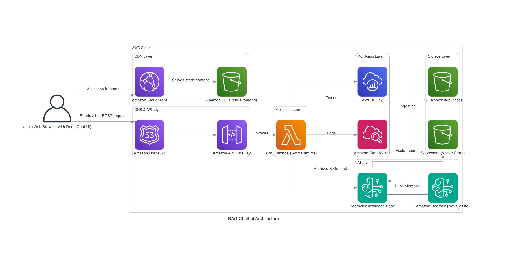

# Virtual Me 2.0 - AI-Powered Personal Chatbot


A "Virtual Clone" chatbot that answers questions about you using **Retrieval Augmented Generation (RAG)**. Version 2.0 is simplified using S3 Vectors for native vector storage and Swift runtime for blazing fast cold starts (~190ms).

---

## What's New in 2.0

- **S3 Vectors**: Native vector storage eliminates custom DynamoDB similarity search
- **Swift Runtime**: Measured cold start time of **~190ms** (21x faster than v1.0's 4s)
- **Memory Optimized**: 256MB memory footprint (50% reduction from 512MB)
- **Simplified Architecture**: Bedrock Knowledge Base handles ingestion and retrieval automatically
- **Cost Optimized**: 50% reduction in Lambda costs, no DynamoDB scan operations

### Performance Metrics

**Cold Start Performance (Measured via CloudWatch):**
- Average: 189.5ms
- Median (P50): 177.5ms
- P99: 213.9ms
- Range: 173-214ms

**Comparison with v1.0:**
- v1.0 (Python): ~4000ms cold start
- v2.0 (Swift): ~190ms cold start
- **21x faster cold starts**

### Code Reduction Metrics

Version 2.0 dramatically simplifies the codebase by leveraging managed AWS services:

| Metric | v1.0 (Python + Terraform) | v2.0 (Swift + SAM) | Reduction |
|--------|---------------------------|---------------------|-----------|
| **Application Code** | 1,488 lines (18 files) | 205 lines (3 files) | **-86%** |
| **Infrastructure Code** | 911 lines (Terraform) | 714 lines (SAM) | **-22%** |
| **Total Lines** | 2,399 | 919 | **-62%** |
| **Cold Start Time** | ~4000ms | ~190ms | **-95%** |
| **Memory Usage** | 512MB | 256MB | **-50%** |

**What was removed:**
- Custom DynamoDB vector store implementation (~400 lines)
- LangGraph orchestration and state management (~300 lines)
- Manual embedding generation and chunking (~200 lines)
- Custom retrieval and similarity search (~250 lines)
- Configuration and utility modules (~338 lines)

**What replaced it:**
- Bedrock Knowledge Base API calls (~50 lines)
- S3 Vectors native integration (managed service)
- Simplified Lambda handler (~155 lines)

The 86% code reduction and 95% cold start improvement means less to maintain, test, and debug while gaining better performance and reliability from managed services.

**Measure your own cold starts:**
```bash
make cold-start-metrics
```

---

## Architecture



> [!NOTE]
> The diagram above is generated using the [Diagrams](https://diagrams.mingrammer.com/) library via the `rag_chatbot_architecture.py` script.

**Flow:**
1. User sends a question via the Deep Chat UI
2. Route 53 → API Gateway → Lambda
3. Lambda runs the RAG pipeline:
   - Embeds the question using **Bedrock Titan**
   - Searches **S3 Vectors** for relevant context via Bedrock Knowledge Base
   - Generates a grounded response using **Bedrock Nova 2 Lite**
4. Response returned to user

---

## Key Technologies

| Layer | Technology |
|-------|------------|
| **Frontend** | Deep Chat UI, CloudFront, S3 |
| **API** | API Gateway (HTTP API) |
| **Compute** | AWS Lambda (Swift 6.0) |
| **LLM** | Amazon Bedrock (Nova 2 Lite) |
| **Embeddings** | Amazon Bedrock (Titan Embed v2) |
| **Vector Store** | S3 Vectors (native vector search) |
| **Knowledge Base** | Amazon Bedrock Knowledge Base |
| **IaC** | AWS SAM (CloudFormation) |

### Technical Decisions

> **S3 Vectors for Serverless Vector Search**
> Native vector storage with automatic indexing and similarity search. Zero operational overhead, sub-100ms retrieval latency.
>
> **Swift for Ultra-Fast Cold Starts**
> Swift runtime achieves measured cold starts of ~190ms (21x faster than Python v1.0). Compiled binary with minimal dependencies and efficient memory usage (256MB).
>
> **Bedrock Knowledge Base**
> Managed ingestion pipeline automatically chunks documents, generates embeddings, and syncs to S3 Vectors.

---

## How RAG Works

The RAG pipeline uses Bedrock Knowledge Base for retrieval:

### 1. Retrieve Node
Bedrock Knowledge Base automatically:
- Converts the question to an embedding vector
- Searches S3 Vectors for similar document chunks
- Returns top-k results with relevance scores

### 2. Generate Node
Combines retrieved context with the question and calls the LLM:

```python
SYSTEM_PROMPT = """You are a Virtual Clone representing the person in the context.
Answer ONLY using information from the CONTEXT below.
If the answer isn't in the context, say "I don't have that information."

CONTEXT:
{context}
"""
```

---

## Quick Start (Local Development)

### Prerequisites
- Python 3.11+
- AWS SAM CLI
- AWS credentials (for Bedrock)

### Setup

```bash
# Clone and setup
git clone <repo-url> && cd virtualme2
python3 -m venv venv && source venv/bin/activate
pip install -r requirements.txt

# Run locally with SAM
cd sam
sam local start-api
```

---

## AWS Deployment

The project uses **AWS SAM (Serverless Application Model)** with CloudFormation templates instead of Terraform. This provides better integration with Lambda development workflows and local testing capabilities.

### Prerequisites
- AWS CLI configured (`aws configure`)
- AWS SAM CLI installed ([installation guide](https://docs.aws.amazon.com/serverless-application-model/latest/developerguide/install-sam-cli.html))
- Swift 6.0+ (for local development)
- Docker (for SAM local testing)

### Deploy to AWS

```bash
# Build the Lambda function
cd sam
sam build

# Deploy (first time - interactive)
sam deploy --guided

# Deploy (subsequent deployments)
sam deploy

# Or use the Makefile
make deploy
```

### Local Testing

```bash
# Start API Gateway locally
cd sam
sam local start-api

# Test a specific function
sam local invoke VirtualMeLambda -e events/test-event.json

# Or use the Makefile
make local
```

### Useful Commands

```bash
# Validate templates
sam validate

# View logs
sam logs -n VirtualMeLambda --tail

# Or use Makefile shortcuts
make logs          # Lambda logs
make logs-api      # API Gateway logs

# Deploy frontend
make deploy-frontend

# Full deployment (backend + frontend)
make deploy-all
```

**Deployed endpoints:**
- Frontend: `https://chat.lemaire.tel`
- API: `https://api.lemaire.tel/chat`

### Why SAM over Terraform?

**Advantages:**
- `sam local start-api` - Run API Gateway + Lambda locally without deployment
- `sam build` - Automatic dependency packaging for Python/Node/Go
- Built-in best practices for Lambda (IAM policies, X-Ray tracing, API Gateway CORS)
- Faster iteration cycle for serverless applications
- Native CloudFormation integration

**Trade-offs:**
- AWS-specific (no multi-cloud support)
- Less flexible than Terraform for complex infrastructure
- Nested stacks can be verbose

For this serverless-first project, SAM provides the best developer experience.

---

## Configuration

| Variable | Default | Description |
|----------|---------|-------------|
| `LLM_MODEL` | `nova-2-lite` | Model alias |
| `LLM_TEMPERATURE` | `0.1` | Response creativity (0.0-1.0) |
| `EMBEDDING_MODEL` | `titan-embed-text-v2` | Embedding model |
| `KNOWLEDGE_BASE_ID` | auto | Bedrock KB ID |

**Available LLM Models:**
- `nova-2-lite` (default, best value)
- `nova-2-pro` (more capable)
- `claude-3-haiku` (Anthropic)

---

## Customizing Your Knowledge Base

Add or edit markdown files in `knowledge_base/`. Upload to S3 and sync:

```bash
aws s3 sync knowledge_base/ s3://virtual-me-v2-kb-prod-<account-id>/
aws bedrock-agent start-ingestion-job \
  --knowledge-base-id <kb-id> \
  --data-source-id <ds-id>
```

---

## Cost Estimate

For personal use (~100 conversations/month): **~$2-3/month**

| Service | Estimated Cost |
|---------|---------------|
| Lambda + API Gateway | $0.20 - $0.50 |
| S3 Vectors | $0.50 - $1.00 |
| Bedrock (Nova 2 Lite) | $0.50 - $1.00 |
| S3 + CloudFront | $0.15 - $0.50 |
| Route53 | $0.50 |

---

## Project Structure

The project is organized into modular directories:
- `sam/` - CloudFormation templates (main + nested stacks), deployment config, and scripts
- `swift/` - Lambda function source code (Swift 6.0)
- `frontend/` - Deep Chat UI static files
- `knowledge_base/` - Your personal data (resume, bio, etc.)

---

## Migration from 1.0

Version 2.0 simplifies the architecture:

**Removed:**
- Custom DynamoDB vector store
- LangGraph orchestration
- Python runtime (slow cold starts)
- Manual embedding generation

**Added:**
- S3 Vectors native storage
- Bedrock Knowledge Base
- Swift runtime (21x faster cold starts)
- Automatic ingestion pipeline

---

Built with AWS Lambda, Amazon Bedrock, S3 Vectors, and AWS SAM
